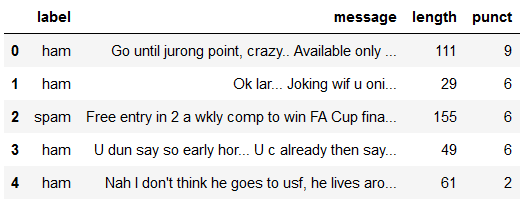

# spam-ham-clf
This project is part of the [NLP course](https://www.udemy.com/course/nlp-natural-language-processing-with-python/) on udemy.\
The <b>task</b> in this project is to classify messages into spam or ham.

## Dataset
\
This dataset has 5,572 messages, of which 4,825 messages are ham and the remaining 747 messages are spam.
## Approach
### Model
<ul>
  <li>Naive-bayes</li>
  <li>SVC</li>
  <li>Logistic Classifier</li>
</ul>

### First Approach 
In this approach we used <b>Message Length and Punctuation Count</b> as features.

### Second Approach
In this approach we used <b>Vectorizer</b> for text extraction 
#### a. Count Vectorizer
#### b. TFIDF Vectorizer

## Result
